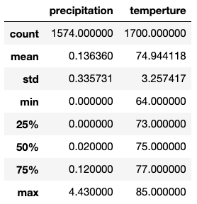
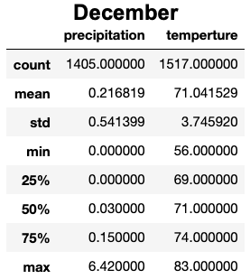

# Climate Analysis

## Objective
Gather data on the seasons of Oahu and determine whether the seasons could affect the surf and ice cream shop business. Specifically, are there certain times of the year when business might be slower, or the type of customer could be different?

## Resources
* climate_analysis.ipynb - contains code and results of the analysis
* hawaii,sqlite - SQLite database of weather observations in Hawaii.

## Analysis

    The folowing includes descriptive statistics of weather observations in the months of June and December. 
     