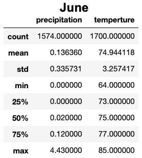

# Climate Analysis

## Objective
Gather data on the seasons of Oahu and determine whether the seasons could affect the surf and ice cream shop business. Specifically, are there certain times of the year when business might be slower, or the type of customer could be different?

## Resources
* climate_analysis.ipynb - contains code and results of the analysis
* hawaii.sqlite - SQLite database of weather observations in Hawaii.

## Analysis

    The following includes descriptive statistics of weather observations in the months of June and December. 
 

    The island of Oahu enjoys tropical weather year round. Temperature remains relatively stable throughout the year with a mean temperature in June of 74.9 F compared to December at 71 F. Data suggests the island is susceptible to colder out of season weather, minimum temperture observed in June is 10 degrees less than the mean for the same month and 15 below the mean in December. In contrast, precipitation varies greatly between the dry summer season and the wet winter season. Mean precipitation in June, .14", is .08" less than in December .22". Based on temperature and precipitation we can infer that surfing and ice cream will be popular in June. The business might experience a downturn in transactions due to higher precipitation in December. 

    Further analysis should explore demographics of Oahu area and attitudes towards surfing. While it is not recommended, many surfers enjoy the sport in the rain. Precipitation may not impact the business as much as the data would suggest. Also, tourism trends have not been explored in the analysis. The shop can expect a boost in transactions from a steady flow of tourists during peak seasons. Tourist might be more inclined to surf and eat ice cream regardless of weather conditions. Finally, further market analysis is required to determine the density of surf shops and ice cream vendors. It is not known if the market is saturated or if enough demand exists to support another competitor.